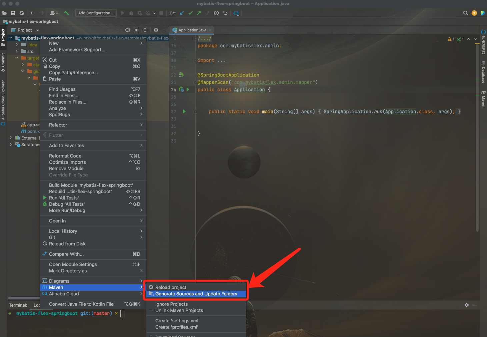

# MyBatis-Flex APT 配置

MyBatis-Flex 使用了 APT（Annotation Processing Tool）技术，在项目编译的时候，会自动根据 Entity 类定义的字段帮你生成 "ACCOUNT" 类以及 Entity 对应的 Mapper 类，
通过开发工具构建项目（如下图），或者执行 maven 编译命令: `mvn clean package` 都可以自动生成。这个原理和 lombok 一致。


>  从1.1.9版本开始，APT默认不生成 Mapper 类文件。如需开启，参考下方配置选项。

## 配置文件和选项

要对MyBatis-Flex 的APT细节选项进行配置，你需要在`resources`目录下创建名为`mybatis-flex.properties`的文件。

支持的配置选项如下：

| 属性名                          | 含义                     | 约束                                                     | 默认值                               |
| ------------------------------- | ------------------------ | -------------------------------------------------------- | ------------------------------------ |
| processor.enable                | 全局启用apt开关          | true/false                                               | true                                 |
| processor.mappersGenerateEnable | 开启 Mapper 自动生成     | true/false                                               | false                                |
| processor.genPath               | APT 代码生成路径         | 合法的绝对或相对路径                                     | target/generated-sources/annotations |
| processor.tablesPackage         | Tables 类名              | 合法的包名                                               | ${entityPackage}.table               |
| processor.tablesClassName       | Tables 类名              | 合法的类名                                               | Tables                               |
| processor.baseMapperClass       | 自定义 Mapper 的父类     | 全路径类名                                               | com.mybatisflex.core.BaseMapper      |
| processor.mappersPackage        | 自定义 Mapper 生成的包名 | 合法的包名                                               | ${entityPackage}.mapper              |
| processor.tablesNameStyle       | 生成辅助类的字段风格     | upperCase, lowerCase<br />upperCamelCase, lowerCamelCase | upperCase                            |
| processor.entity.ignoreSuffixes | 过滤 Entity 后缀         | string                                                   | -                                    |


## APT 代码生成路径

默认在 Entity 类所在的 maven 项目的 `target/generated-sources/annotations` 目录下，
如果 Entity 是 `test/java` 目录下的测试代码，APT 生成的代码则放在 `target/generated-test-sources/test-annotations`
目录下。

如果我们不想让生成的代码放在这些目录，这可以添加如下配置：

```properties
processor.genPath = your-path
```

genPath 可以是绝对路径，也可以是相对路径，如果填写的是相对路径，那么则是相对 Maven 根模块的目录。


## APT 生成的 Tables 类名和包名

默认情况下， APT 生成的类名为 "Tables"，而包名为 entity 的包添加上 ".table"，假设 Account.java
的包名为 "com.mybatisflex.entity"，那么生成的包名则为 "com.mybatisflex.entity.table"。

添加如下配置，自定义生成的类名和包名。

```properties
processor.tablesPackage = com.your-package
processor.tablesClassName = your-class-name
```

## 自定义 Tables 的字段风格

默认情况下，APT 生成的 Tables 生成的默认内容如下：

```java
public class Tables {

    public static final UserTableDef USER = new UserTableDef("sys_user");

    public static class UserTableDef extends TableDef {

        public QueryColumn ID = new QueryColumn(this, "id");
        public QueryColumn USER_NAME = new QueryColumn(this, "user_name");

        public UserTableDef(String tableName) {
            super(tableName);
        }
    }
}
```

在生成的内容中，`USER`、`ID`、`USER_NAME` 等都是 **"大写 + 下划线"** 的风格，修改风格需要添加入配置：

```properties
#upperCase, lowerCase, upperCamelCase, lowerCamelCase
processor.tablesNameStyle=upperCase
```
风格支持 4 中配置，默认（未配置时）为 upperCase，支持的配置分别为：

- upperCase：大写 + 下划线，例如：USER_NAME
- lowerCase：小写 + 下划线，例如：user_name
- upperCamelCase：首字母大写的驼峰命名，例如：UserName
- lowerCamelCase：首字母小写的驼峰命名，例如：userName


## APT 过滤 Entity 后缀
在某些情况下，Entity 类可能会有某些通用的后缀，比如 `AccountModel` 或者 `AccountDto` 等，我们希望生成的代码，
不包含 `Model` `Dto` 等后缀，可以添加如下的配置：

```properties
processor.entity.ignoreSuffixes = Model, Dto
```


## APT 开启 Mapper 生成

从 v1.1.9 开始， APT 的 Mapper 功能是关闭的，若需要开启 Mapper 的自动生成功能，需要添加一下配置。

```properties
processor.mappersGenerateEnable = true
```

以上的配置，会关闭整个项目的 APT 生成，若我们只想关闭某一个 Entity 的 APT 生成，那么可以通过配置注解 `@Table(mapperGenerateEnable = false)` 进行关闭。


## APT 生成的 Mapper 包名

默认情况下， APT 生成的 Mapper 类名为 "***Mapper"，而包名为 entity 的包添加上 ".mapper"，假设 Account.java
的包名为 "com.mybatisflex.entity"，那么生成的 Mapper 类为 "com.mybatisflex.mapper.AccountMapper"。

添加如下配置，自定义 Mapper 生成的包名。

```properties
processor.mappersPackage = com.your-package
```

## 自定义 Mapper 的父类

默认情况下，生成的所有 Mapper 是都继承 `com.mybatisflex.core.BaseMapper` 接口，但是在某些场景下（比如：新增更多的通用方法等），用户可以自定义自己的
`BaseMapper`，然后通过 APT 配置生成。

```properties
processor.baseMapperClass=com.domain.mapper.MyBaseMapper
```


## 和 Lombok、Mapstruct 整合

在很多项目中，用到了 Lombok 帮我们减少代码编写，同时用到 Mapstruct 进行 bean 转换。使用到 Lombok 和 Mapstruct 时，其要求我们再 pom.xml 添加 `annotationProcessorPaths` 配置，
此时，我们也需要把 MyBatis-Flex 的 annotation 添加到 `annotationProcessorPaths` 配置里去，如下图所示：

```xml 24,25,26,27,28
<plugin>
    <groupId>org.apache.maven.plugins</groupId>
    <artifactId>maven-compiler-plugin</artifactId>
    <version>3.8.1</version>
    <configuration>
        <source>1.8</source>
        <target>1.8</target>
        <annotationProcessorPaths>
            <path>
                <groupId>org.projectlombok</groupId>
                <artifactId>lombok</artifactId>
                <version>${org.projectlombok.version}</version>
            </path>
            <path>
                <groupId>org.projectlombok</groupId>
                <artifactId>lombok-mapstruct-binding</artifactId>
                <version>${lombok-mapstruct-binding.version}</version>
            </path>
            <path>
                <groupId>org.mapstruct</groupId>
                <artifactId>mapstruct-processor</artifactId>
                <version>${org.mapstruct.version}</version>
            </path>
            <path>
                <groupId>com.mybatis-flex</groupId>
                <artifactId>mybatis-flex-processor</artifactId>
                <version>${mybatis-flex.version}</version>
            </path>
        </annotationProcessorPaths>
    </configuration>
</plugin>
```

## Gradle 编译配置

当使用 Gradle 编译的情况下，需要添加 `annotationProcessor` 配置:

```
dependencies {
    ...
    annotationProcessor 'com.mybatis-flex:mybatis-flex-processor:1.2.8'
}
```

## 开发工具无法导入生成的代码？

如下图所示，点击项目目录（注意是项目的根目录），右键 > Maven：

- 1、 先点击 `Generate Sources and Update Folders`。
- 2、 再点击 `Reload project`。



